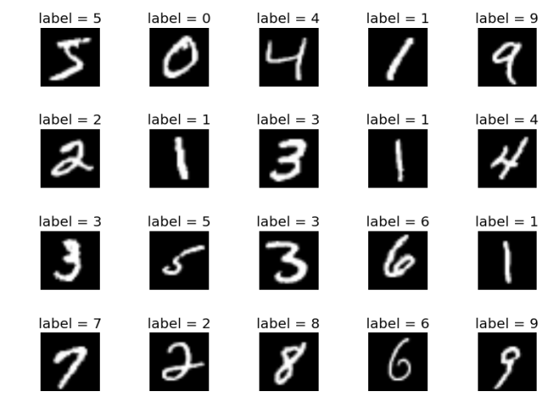

# zoidberg2.0_2022_13

## Description

A school project whose goal is to determine if a patient is healthy or sick by analyzing the patient's chest x-ray.

Several algorithms are used for this. The objective is to discover the different methods of image recognition.

## Algorithms used

* SVC
* SVC Linear
* MLP Classifier
* Prédiction KNN
* Naive Bayes
* Decision Tree
* Rendom Forest
* Extremly Randomized Trees

## Datasets used

### Chest X-ray

### Mnist Digits

